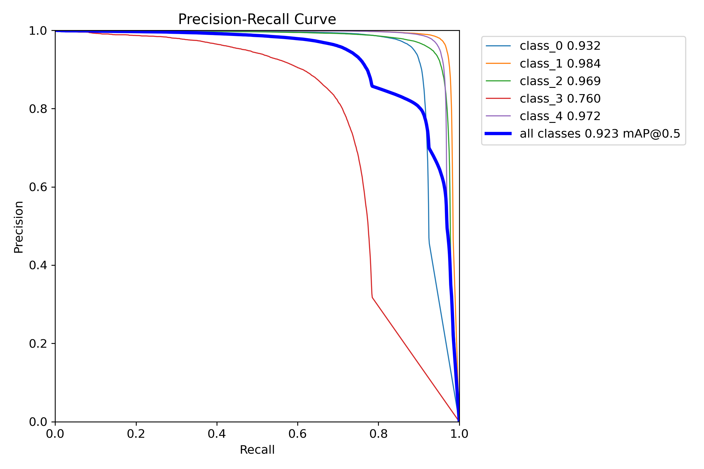
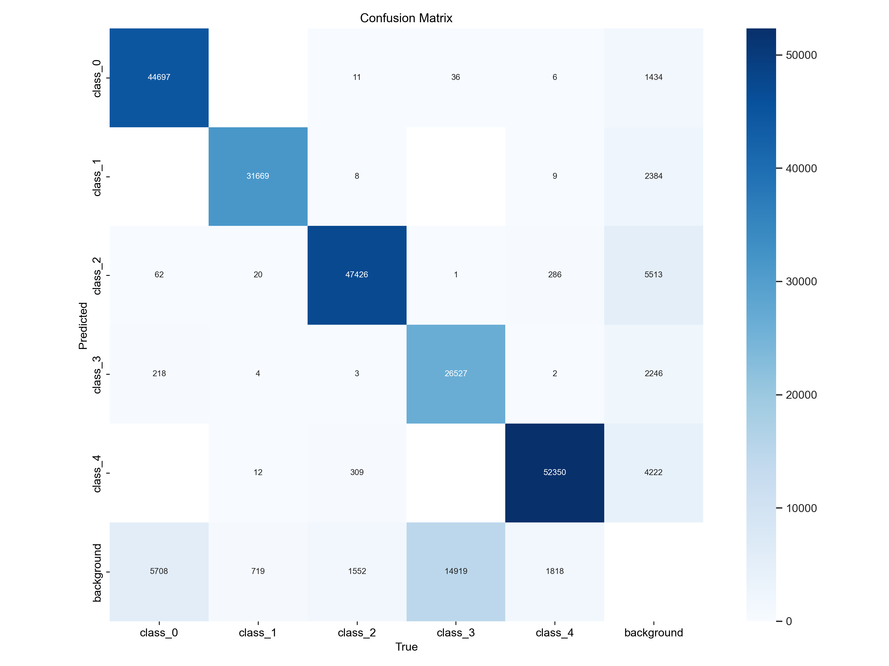
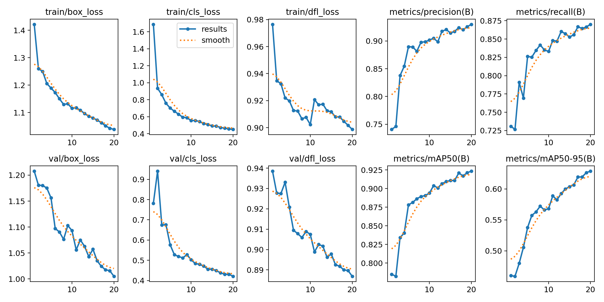

# Detection

Trains a YOLOv8/YOLOv10 object detector to find and classify microbial colonies on Petri-dish
images from the [AGAR dataset](https://agar.neurosys.com/), across 5 species:
`S.aureus`, `B.subtilis`, `P.aeruginosa`, `C.albicans`, `E.coli`.

## Results (YOLOv8n, 20 epochs, 640px)

| Metric | Value |
|---|---|
| Precision | 0.930 |
| Recall | 0.870 |
| mAP50 | 0.923 |
| mAP50-95 | 0.629 |





## Usage

1. Download AGAR (or your own labeled subset) and convert its JSON annotations to YOLO labels:
   ```bash
   python prepare_yolo_labels.py -i path/to/agar/images -o dataset/train/labels
   ```
2. Point `data.yaml` at your `train`/`valid` image and label folders.
3. Train:
   ```bash
   python train.py --data data.yaml --epochs 20 --device cuda
   ```
4. Sanity-check labels on a given image id:
   ```bash
   python visualize_dataset.py 1287 --dataset_dir dataset
   ```
5. Run live detection off a webcam with a trained checkpoint:
   ```bash
   python live_detection.py --weights runs/detect/train/weights/best.pt
   ```

Trained weights aren't checked into this repo — retrain from the steps above, or point
`live_detection.py` at your own `best.pt`.
