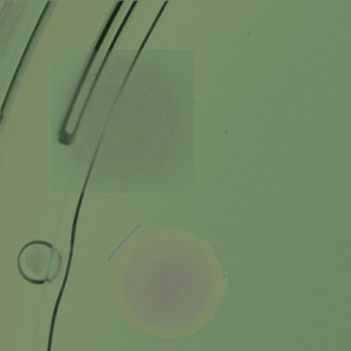
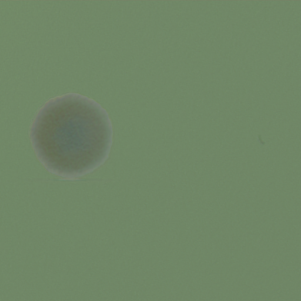

# Synthetic data generation

Generates synthetic labeled Petri-dish images by extracting real colony patches from AGAR,
compositing them onto empty-dish backgrounds, and applying neural style transfer so the
result blends into a target dish's lighting/texture. Adapted from NeuroSYS's
[microbial-dataset-generation](https://github.com/NeuroSYS-pl/microbial-dataset-generation),
which accompanies:

> J. Pawłowski, S. Majchrowska, & T. Golan, *Generation of microbial colonies dataset with
> deep learning style transfer*, Scientific Reports 12, 5212 (2022).

The goal of pulling this in was to test whether style-transfer-augmented training data
improves on the [detection](../detection) baseline (P=0.930, R=0.870, mAP50=0.923).

## Status

The pipeline runs end-to-end on current Python/PyTorch/scikit-image after fixing several
places where 2021-era code had drifted from current library APIs:

- `networkx.from_numpy_matrix` → `from_numpy_array` (removed in networkx 3.x)
- `skimage`'s `multichannel=` kwarg → `channel_axis=-1` (removed in scikit-image 0.21+)
- `chan_vese(max_iter=...)` → `max_num_iter=...` (renamed)
- `torchvision.models.vgg19(pretrained=True)` → `weights=VGG19_Weights.DEFAULT`
- a latent bug in the original code: `uint8_array * 65536` used to silently wrap around
  under old NumPy; NumPy 2's stricter casting turns that into a hard `OverflowError`.
  Fixed by casting to `int64` before the multiply (`grow_colonies.py`, all 4 quadrant blocks).

Two sample generated dishes are in [`samples/`](samples), each with its YOLO-style bounding
boxes (`.json`) and an instance-segmentation preview (`_iseg.png`):

| Generated dish | Instance segmentation |
|---|---|
|  |  |
|  |  |

These were capped at 80/500 optimization steps to produce a result in reasonable time, so the
stylization is visibly under-converged — flatter and more pastel than the paper's fully
converged output. They demonstrate the mechanics working (correct colony placement, correct
bbox transforms through crop/rotation, correct instance masks), not final training-ready quality.

**Not yet done:** a full retrain-and-compare against the detection baseline. On a single
laptop RTX 4070 this network is slow at its native 1024×1024 resolution — roughly
**7s/optimization step**, so one dish at the paper's default 500 steps is about **65 minutes**.
Generating enough synthetic dishes to meaningfully augment training (hundreds, matching the
paper's own augmentation scale) is on the order of tens of GPU-hours. Candidates for speeding
this up before attempting that: mixed precision (`torch.autocast`), batching multiple dishes
per style-transfer call instead of one dish per full 500-step optimization, or reducing the
working resolution.

## Usage

1. Download the AGAR style-transfer input pack (100 higher-resolution AGAR images + empty
   dishes + style dishes) — see the
   [upstream repo](https://github.com/NeuroSYS-pl/microbial-dataset-generation) for the link.
2. `pip install -r requirements.txt` (install `torch`/`torchvision` first with the CUDA index
   matching your GPU driver).
3. Extract colony patches from the real AGAR images:
   ```bash
   python get_patches.py -i input_data -o colonies
   ```
4. Generate synthetic dishes (runs forever — stop it once you have enough; each dish is
   written as 4 quadrant crops):
   ```bash
   python grow_colonies.py -c colonies -e empty_dishes -s style_dishes -o generated
   ```
