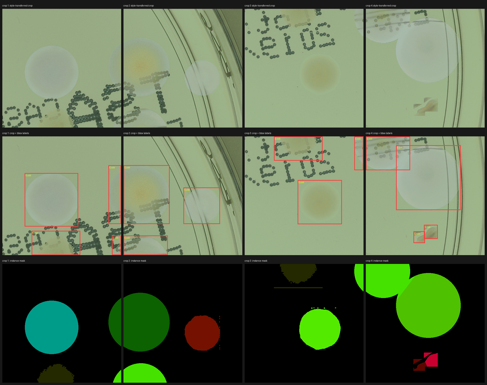

# Synthetic data generation

Generates synthetic labeled Petri-dish images by extracting real colony patches from AGAR,
compositing them onto empty-dish backgrounds, and applying neural style transfer so the
result blends into a target dish's lighting/texture. Adapted from NeuroSYS's
[microbial-dataset-generation](https://github.com/NeuroSYS-pl/microbial-dataset-generation),
which accompanies:

> J. Pawłowski, S. Majchrowska, & T. Golan, *Generation of microbial colonies dataset with
> deep learning style transfer*, Scientific Reports 12, 5212 (2022).

The goal is to test whether style-transfer-augmented training data improves on the
[detection](../detection) baseline (P=0.930, R=0.870, mAP50=0.923).

## Status

The pipeline runs end-to-end on current Python / PyTorch / scikit-image / NumPy 2 and produces
labeled crops. **No detector has been trained on synthetic data yet**, so there is no measured
effect on the baseline.



Top row: style-transferred 512×512 crops. Middle: bounding-box labels. Bottom: instance masks.
The full crops, labels and masks for this dish are in [`samples/`](samples).

Known limitations of the current output:
- Colonies that fell back to an inscribed ellipse (see below) have crisp, uniform edges and can
  look pasted-on; overlapping annotation groups can produce blocky fragments.
- Each generated dish contains a single species (the generator picks one per dish), so a
  dataset needs to be balanced across dishes.
- Stylization quality was only checked by eye.

## What was changed from upstream

Library-drift fixes (the 2021 code no longer ran):
- `networkx.from_numpy_matrix` → `from_numpy_array`
- `skimage` `multichannel=` → `channel_axis=-1`; `chan_vese(max_iter=)` → `max_num_iter=`
- `torchvision.models.vgg19(pretrained=True)` → `weights=VGG19_Weights.DEFAULT`
- `uint8_array * 65536` used to wrap silently under old NumPy and now raises `OverflowError`;
  cast to `int64` first (`grow_colonies.py`, all 4 quadrant blocks).

Label-quality fix (`get_patches.py`, `lib.py`):
- On low-contrast species (mostly *B. subtilis*, many *E. coli*), Chan-Vese segmentation
  frequently collapsed to "everything is colony". The blending step then averaged an empty
  background set (NaN → alpha 0), so a bounding box was written for a colony that was invisible,
  or the mask became the whole box (square patches). In one extraction run, 162 of 281
  *B. subtilis* and 257 of 589 *E. coli* patches had essentially empty alpha.
- Now the segmentation is validated (must cover 20–96% of the annotated box); otherwise the alpha
  falls back to an ellipse inscribed in each annotated box. The NaN case is also guarded.
  After the fix no extracted patch has an empty or full-box alpha.

Speed (`transfer_style_lib.py`):
- The style-transfer loop now runs under bf16 autocast. On an 8 GB laptop RTX 4070, the fp32
  loop at 1024×1024 needs ~9.9 GB and spills into system RAM (~4.7 s/step); bf16 needs ~6 GB
  and ran at ~0.4 s/step in a micro-benchmark. One full 500-step dish (composition + style
  transfer + save) took ~6.4 minutes, versus roughly 65 minutes before.
- bf16 was validated visually, not by comparing against fp32 output numerically.

## Usage

1. Download the AGAR style-transfer input pack (100 higher-resolution AGAR images + empty
   dishes + style dishes) — see the
   [upstream repo](https://github.com/NeuroSYS-pl/microbial-dataset-generation) for the link.
2. `pip install -r requirements.txt` (install `torch`/`torchvision` first with the CUDA index
   matching your GPU driver).
3. Extract colony patches from the real AGAR images:
   ```bash
   python get_patches.py -i input_data -o colonies
   ```
4. Generate synthetic dishes (runs forever — stop it once you have enough; each dish is
   written as 4 quadrant crops):
   ```bash
   python grow_colonies.py -c colonies -e empty_dishes -s style_dishes -o generated
   ```
5. Export to a YOLO detection dataset (train/val split by source dish, so crops of one dish
   never land in both splits):
   ```bash
   python export_yolo.py -i generated -o yolo_dataset
   ```
   The exporter maps AGAR class ids to the detector's class order, drops boxes smaller than
   12 px, and drops any box whose instance mask covers under 10% of it (a label with no visible
   colony).

### Label coordinate convention

The generated `.json` files store `x`/`width` along image **rows** and `y`/`height` along
**columns** (the transpose of the usual image convention), inherited from the upstream code.
`export_yolo.py` converts this to standard YOLO boxes; if you consume the JSON directly, swap
the axes.
